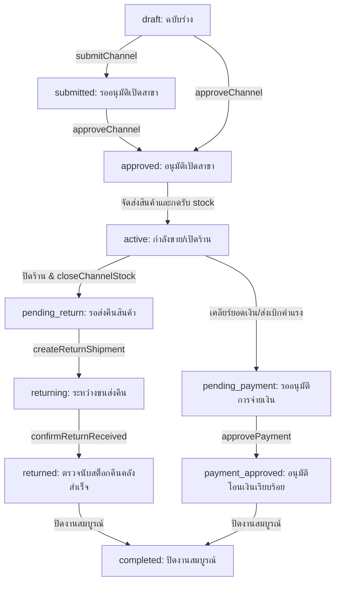

# Saran Jeans — Business Logic & Code Workflows

เอกสารนี้อธิบายเกี่ยวกับขั้นตอนการทำงาน (Workflows), ความหมายของสถานะต่างๆ (Statuses), และเงื่อนไขสำคัญในโค้ดของโปรเจกต์นี้ทั้งหมด เพื่อให้ผู้พัฒนาหรือ AI Agent เข้าใจตรรกะทางธุรกิจได้อย่างถูกต้อง

---

## 1. Sales Channel Lifecycle (ขั้นตอนและสถานะของ Event/สาขา)

สถานะของ `SalesChannel` (Event หรือ Branch) จะมีขั้นตอนและวงจรชีวิต (Lifecycle) ดังต่อไปนี้:

### รายละเอียดของแต่ละสถานะ

1. **`draft` (ฉบับร่าง)**
   - **การสร้าง**: แอดมินสร้างขึ้นผ่านหน้าสร้างสาขา/Event โค้ดจะรันอัตโนมัติเป็น `EV-YYYYMM-XXX` สำหรับ Event หรือ `BR-XXX` สำหรับ Branch
   - **ข้อมูลที่พ่วงมา**: ข้อมูลพนักงานประจำสาขา (`ChannelStaff`) และคำขอเบิกสต็อกเริ่มต้น (`StockRequest` ประเภท `INITIAL` หากมีการกรอกจำนวน)

2. **`submitted` (รออนุมัติเปิดสาขา)**
   - **การทำงาน**: แอดมินส่งคำขอเปิดสาขา (เรียกฟังก์ชัน `submitChannel`) เพื่อรอการตรวจสอบและอนุมัติจากผู้มีอำนาจ

3. **`approved` (อนุมัติเปิดสาขา)**
   - **การทำงาน**: เมื่อได้รับการอนุมัติ (เรียกฟังก์ชัน `approveChannel`) ระบบจะทำการ**อนุมัติใบขอสต็อกเริ่มต้น (INITIAL Stock Request)** ของสาขานั้นเป็นสถานะ `approved` โดยอัตโนมัติด้วย
   - **การรับของเข้าสาขา**: คลังสินค้าจะเริ่มกระบวนการจัดส่ง เมื่อสินค้ามาถึงหน้างาน พนักงานประจำสาขาจะกดยืนยันรับของเข้า (`confirmReceiving`) เมื่อยืนยันเสร็จ สถานะของสาขาจะเปลี่ยนเป็น **`active`** อัตโนมัติ

4. **`active` (กำลังดำเนินการขาย)**
   - **การทำงาน**: สาขาเปิดทำการแล้ว พนักงานสามารถล็อกอินเข้าเครื่อง POS ประจำสาขาเพื่อบันทึกบิลขาย (`Sale`), ทำรายการคืนของชำรุด หรือบันทึกเบิกค่าใช้จ่ายอื่นๆ หน้างาน (`ChannelExpense`) ได้

5. **`pending_return` (รอส่งคืนสินค้า)**
   - **การทำงาน**: เมื่อจบ Event พนักงานจะทำรายการส่งคืนสินค้าที่เหลือผ่านหน้าเว็บพนักงาน (เรียกฟังก์ชัน `closeChannelStock`) โดยต้องระบุสินค้าชำรุด (`damaged`) และสินค้าสูญหาย (`missing`)
   - ระบบจะสร้างใบสรุปยอดคืน (`ReturnSummary` และ `ReturnItem`) เพื่อเทียบยอดสต็อกกับประวัติการขาย

6. **`returning` (ระหว่างขนส่งคืน)**
   - **การทำงาน**: พนักงานหรือผู้นำส่งลงบันทึกข้อมูลการจัดส่งสินค้าคืนคลัง (เรียกฟังก์ชัน `createReturnShipment`) โดยระบุบริษัทขนส่งและเลขพัสดุ (Tracking)

7. **`returned` (คืนสินค้าคลังสำเร็จ)**
   - **การทำงาน**: เจ้าหน้าที่คลังสินค้าตรวจนับสินค้าที่ถูกส่งกลับมา และกดยืนยันรับของคืนคลัง (เรียกฟังก์ชัน `confirmReturnReceived`) ระบบจะทำการ **บวกสต็อกสินค้ากลับเข้าสู่คลังใหญ่ (WarehouseStock)** ตามยอดที่นับได้จริง และบันทึกประเภทประวัติสต็อกเป็น `RETURN` ใน `StockMovement`

8. **`pending_payment` (รออนุมัติการจ่ายเงิน)**
   - **การทำงาน**: หลังจากส่งสรุปเบิกยอดเงินค่าแรง/ค่าคอมพนักงานประจำสาขา แอดมินหรือฝ่ายการเงินจะทำการส่งเรื่องขออนุมัติจ่าย (เรียกฟังก์ชัน `submitForPaymentApproval`)

9. **`payment_approved` (อนุมัติโอนเงินเรียบร้อย)**
   - **การทำงาน**: ผู้บริหารหรือฝ่ายการเงินกดยืนยันอนุมัติการจ่ายเงิน (เรียกฟังก์ชัน `approvePayment`)

10. **`completed` (ปิดงานสมบูรณ์)**
    - **การทำงาน**: สถานะสุดท้ายหลังจากเคลียร์ทั้งส่วนสต็อกคืนสินค้าสำเร็จ (`returned`) และเคลียร์เงินบัญชีสำเร็จ (`payment_approved`) แล้ว (เรียกฟังก์ชัน `closeChannelManual` เพื่อจบกระบวนการ)

---

## 2. Stock Request Lifecycle (วงจรชีวิตการขอสต็อก)

`StockRequest` มี 2 ประเภทคือ `INITIAL` (การขอสต็อกเปิดสาขา) และ `TOPUP` (การขอสต็อกเพิ่มระหว่างขาย) โดยมีสถานะการทำงานดังนี้:

1. **`draft` (ร่างคำขอ)**: พนักงานประจำสาขาร่างความต้องการสินค้าเพิ่ม
2. **`submitted` (ส่งคำขอแล้ว)**: ส่งมายังฝั่งหลังบ้าน (Back-office) เพื่อรออนุมัติ
3. **`approved` (อนุมัติแล้ว)**: แอดมินอนุมัติคำขอ
4. **`allocated` (จัดสรรสินค้าแล้ว)**: คลังสินค้าทำการอัปโหลดไฟล์ Excel เพื่อระบุรหัสบาร์โค้ดและสี/ไซส์ที่จัดสรรให้จริง (ฟังก์ชัน `uploadAllocation`)
5. **`packed` (แพ็คของแล้ว)**: คลังสินค้าแพ็คสินค้าลงกล่องเสร็จสิ้น
6. **`shipped` (ส่งสินค้าแล้ว)**: คลังสินค้าจัดส่งสินค้าและบันทึกข้อมูลจัดส่ง
7. **`received` (รับสินค้าเข้าสาขาสำเร็จ)**: พนักงานกดยืนยันการตรวจรับของปลายทาง (ฟังก์ชัน `confirmReceiving`) 
   - **สำคัญ**: เมื่อเปลี่ยนเป็น `received` ระบบจะเพิ่มจำนวนสินค้าเข้าสู่สต็อกสาขา (`ChannelStock`) และหักจำนวนสินค้าออกจากคลังใหญ่ (`WarehouseStock`) โดยอัตโนมัติ

---

## 3. Payroll & Compensation Rules (เงื่อนไขการคิดเงินและภาษีหัก ณ ที่จ่าย)

การคิดยอดโอนค่าแรง ค่าคอม และภาษี 3% สำหรับพนักงาน มีกฎเกณฑ์ทางธุรกิจที่เข้มงวดดังนี้:

### 3.1 ภาษีหัก ณ ที่จ่าย 3% (Withholding Tax - ภ.ง.ด.3)
- **เงื่อนไขวันทำงาน**: พนักงานจะถูกหักภาษี ณ ที่จ่าย 3% ก็ต่อเมื่อ **จำนวนวันทำงานมากกว่า 10 วัน** (`daysWorked > 10`) เท่านั้น หากไม่เกิน 10 วัน ภาษีจะเป็น 0 บาท
- **ฐานเงินได้ที่นำมาคำนวณภาษี**:
  1. **ค่าจ้าง/ค่าแรง (มาตรา 40(1))**: คำนวณจาก `daysWorked × dailyRate`
  2. **ค่าคอมมิชชั่น/ค่านายหน้า (มาตรา 40(2))**: คำนวณจาก `totalCommission` (ค่าคอมมิชชั่นพื้นฐาน) รวมกับ **ยอดเบิกในหมวด "ค่าเป้า"**
- **ค่าใช้จ่ายเบิกตัวอื่นๆ**: ค่าเดินทาง, ค่าอาหาร, ค่าที่พัก, ฯลฯ **จะไม่นำมารวมคำนวณภาษีหัก ณ ที่จ่าย** (ได้รับการยกเว้นภาษีตามกฎหมาย)

### 3.2 ยอดเงินโอนสุทธิ (Net Payout)
ยอดโอนรวมพนักงานในตารางสรุป รายการ Excel และระบบโอนเงินของธนาคาร KCASH จะเป็นยอดสุทธิหลังหักภาษี ดังนี้:
$$\text{ยอดโอนรวม} = \text{ค่าแรงรวม} + \text{ค่าคอมมิชชั่น} + \text{ค่าใช้จ่ายเบิกทั้งหมด} - \text{ภาษีหัก ณ ที่จ่าย 3\%}$$

### 3.3 รายการเบิก "ค่าเป้า" (Target Incentive)
- **ค่าเป้า** ถูกประกาศเป็นหมวดหมู่ประเภทพนักงาน (`type: 'emp'`) ในระบบบันทึกค่าใช้จ่าย
- เมื่อพนักงานเบิก ยอดจะถูกเก็บบันทึกเป็น `ChannelExpense` ด้วยหมวดหมู่ `"ค่าเป้า"`
- ในแง่การแสดงผลตารางสรุปค่าใช้จ่าย ค่าเป้าจะแสดงในยอดเบิก แต่ในการคำนวณเพื่อออกใบหัก ณ ที่จ่าย ภ.ง.ด.3 และการหักภาษี 3% ยอดค่าเป้าจะถูกนำมารวมเข้ากับหมวด **"ค่าคอมมิชชั่น (มาตรา 40(2))"**
