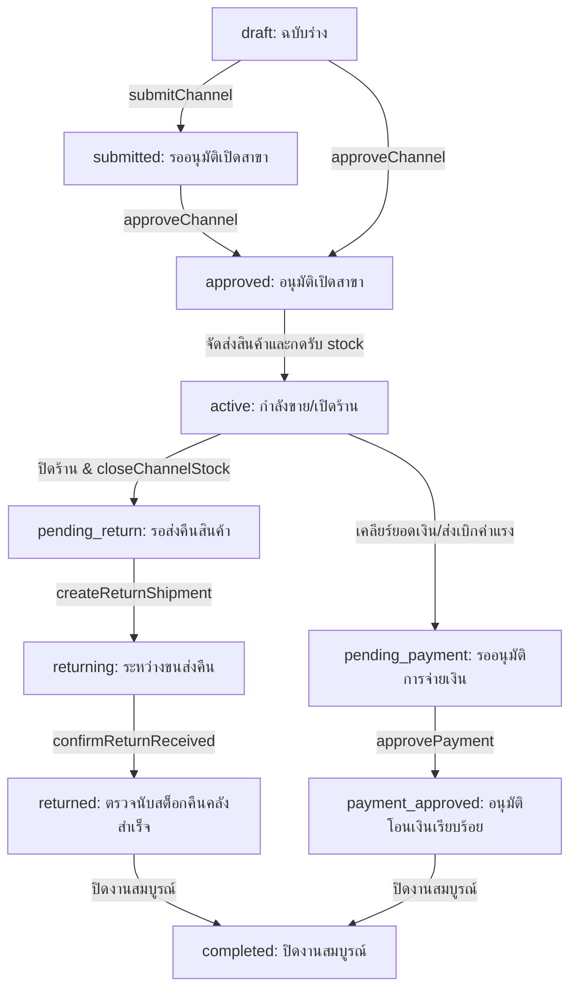
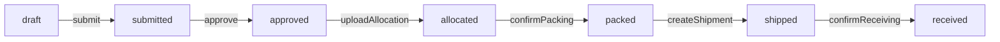

# Saran Jeans — Business Logic & Code Workflows

เอกสารนี้อธิบายเกี่ยวกับขั้นตอนการทำงาน (Workflows), ความหมายของสถานะต่างๆ (Statuses), และเงื่อนไขสำคัญในโค้ดของโปรเจกต์นี้ทั้งหมด เพื่อให้ผู้พัฒนาหรือ AI Agent เข้าใจตรรกะทางธุรกิจของทุกโมดูลได้อย่างถูกต้อง

---

## 1. Sales Channel Lifecycle (โมดูล Event/สาขา)

สถานะของ `SalesChannel` (Event หรือ Branch) จะมีขั้นตอนและวงจรชีวิต (Lifecycle) ดังต่อไปนี้:

### รายละเอียดสถานะและการทำรายการ (Actions)
- **`draft` (ฉบับร่าง)**: สถานะแรกเริ่มหลังสร้างสาขา/Event โค้ดรันอัตโนมัติ (`EV-YYYYMM-XXX` หรือ `BR-XXX`) มีการผูก `ChannelStaff` และ `StockRequest` (ประเภท `INITIAL`)
- **`submitted` (ส่งรออนุมัติ)**: แอดมินส่งขอเปิดสาขา (เรียกฟังก์ชัน `submitChannel`)
- **`approved` (อนุมัติแล้ว)**: เมื่อแอนมินอนุมัติผ่านฟังก์ชัน `approveChannel` ใบขอสต็อกเริ่มต้น (INITIAL Request) จะได้รับอนุมัติอัตโนมัติ
- **`active` (กำลังดำเนินงาน)**: เกิดขึ้นเมื่อพนักงานสาขาตรวจรับสต็อกสินค้าเข้าสาขาเสร็จสิ้น (เรียก `confirmReceiving`)
- **`pending_return` (รอคืนสินค้า)**: พนักงานส่งยอดสรุปสินค้าเหลือ/ชำรุด/สูญหายเมื่อจบงาน (เรียก `closeChannelStock`)
- **`returning` (กำลังตีกลับ)**: พนักงานบันทึกการนำส่งพัสดุตีกลับคลัง (เรียก `createReturnShipment`)
- **`returned` (คืนคลังสำเร็จ)**: คลังใหญ่นับของและกดยืนยันรับคืน ระบบจะบวกยอดกลับเข้าคลังหลัก (เรียก `confirmReturnReceived`)
- **`pending_payment` (รออนุมัติโอนเงิน)**: ส่งเรื่องเบิกจ่ายเงินค่าแรง/คอมมิชชั่นพนักงาน (เรียก `submitForPaymentApproval`)
- **`payment_approved` (อนุมัติจ่ายเงินแล้ว)**: ได้รับการอนุมัติยอดโอนจากฝ่ายบริหาร/บัญชี (เรียก `approvePayment`)
- **`completed` (ปิดงานสมบูรณ์)**: ปิด Event หรือเคลียร์สาขาทั้งหมดสมบูรณ์ (เรียก `closeChannelManual`)

---

## 2. Stock Request & Inventory (โมดูลสต็อกและการขอสินค้า)

ระบบสต็อกแบ่งคำขอเบิกสินค้าออกเป็น 2 ประเภท คือ `INITIAL` (สต็อกรอบแรกเพื่อเปิดร้าน) และ `TOPUP` (สต็อกเพิ่มระหว่างขาย)

### วงจรชีวิตของใบเบิกสต็อก (Stock Request Statuses)

- **`createStockRequest`**: สร้างใบเบิกสต็อก (สถานะ `draft`)
- **`submitStockRequest`**: ส่งขออนุมัติสต็อก (สถานะ `submitted`)
- **`approveStockRequest`**: แอดมินตรวจสอบยอดและกดยืนยัน (สถานะ `approved`)
- **`uploadAllocation` (จัดสรรสินค้า)**: เจ้าหน้าที่คลังสินค้าอัปโหลดไฟล์ Excel เพื่อยืนยันจำนวนสินค้าบาร์โค้ดที่สามารถจ่ายให้ได้จริง (สถานะ `allocated` และระบบจะจองยอดสต็อกคลังใหญ่)
- **`confirmPacking`**: ยืนยันแพ็คสินค้าลงกล่องเสร็จสิ้น (สถานะ `packed`)
- **`createShipment`**: ยืนยันการส่งออกขนส่งพร้อมระบุแทร็กกิ้ง (สถานะ `shipped`)
- **`confirmReceiving` (ตรวจรับของเข้าสาขา)**: พนักงานหน้างานเปิดตรวจนับของเทียบยอดและกดยืนยันรับของ (สถานะ `received`)
  - **ตรรกะเบื้องหลัง**: ระบบจะเพิ่มจำนวนสินค้าเข้าคลังสาขา (`ChannelStock`) และตัดจำนวนออกจากคลังหลัก (`WarehouseStock`) อัตโนมัติ

---

## 3. Sales & Point of Sale (โมดูลการขายหน้าร้าน)

การเปิดบิลขายหน้าร้านสำหรับพนักงาน PC ผ่านเครื่อง POS มีขั้นตอนดังนี้:

- **`createSale` (สร้างบิลขาย)**
  - รับข้อมูลสินค้า ราคาขาย คูปอง/โปรโมชั่น ส่วนลด และลูกค้า (`customerId` - สำหรับงานขายเครดิต)
  - ระบบทำงานแบบ Transaction:
    - เจนโค้ดบิลอัตโนมัติ: `{รหัสสาขา}-{รันนิ่งสี่หลัก}` (เช่น `EV-2607-001-0005`)
    - หักสต็อกสินค้าในคลังสาขา (`ChannelStock.quantity` ลดลง และ `soldQuantity` เพิ่มขึ้น)
    - บันทึกการทำรายการลงใน `Sale` และ `SaleItem`
    - หากชำระด้วยเงินสด ระบบจะบันทึกเงินทอนและสรุปยอดเงินสดประจำวัน
- **`cancelSale` (ยกเลิกบิลขาย)**
  - ค้นหาบิลขายเดิม เปลี่ยนสถานะเป็น `cancelled`
  - คืนยอดสินค้าเข้าสู่สต็อกสาขา (`ChannelStock.quantity` เพิ่มขึ้น และ `soldQuantity` ลดลง)
  - บันทึกการเคลื่อนไหวของสต็อกเป็นประวัติประเภท `CANCEL_SALE` ลงใน `StockMovement`

---

## 4. Invoices & Credit Notes (โมดูลใบกำกับภาษีและใบลดหนี้)

โมดูลนี้ใช้สำหรับบริหารจัดการเอกสารทางการเงินกับลูกค้า/ห้างสรรพสินค้า/พาร์ทเนอร์

- **`createInvoice` (ออกใบกำกับภาษี)**
  - คำนวณจากสินค้าทั้งหมดที่จัดส่งจริงในสาขา/Event (`getChannelShippedItems`)
  - คำนวณฐานเงิน Subtotal, ส่วนลดพาร์ทเนอร์, ภาษีมูลค่าเพิ่ม (VAT 7%) และยอดรวมสุทธิ (Grand Total)
  - สถานะเริ่มต้นคือ `draft` และเปลี่ยนเป็น `submitted` เมื่อส่งออกเอกสาร
- **`createCreditNote` (ออกใบลดหนี้)**
  - ออกเมื่อมีการตีคืนสินค้าหลังการขาย หรือราคาสินค้าผิดพลาด
  - ระบบจะคำนวณสัดส่วนมูลค่าที่ลดลงตามจริงและลดภาษีมูลค่าเพิ่ม (VAT) ในใบลดหนี้โดยอ้างอิงกับใบกำกับภาษีเดิม
  - เจนเนอเรตเลขที่ใบลดหนี้อัตโนมัติ `CN-YYYYMM-XXXX`

---

## 5. HR, Payroll & Compensation (โมดูลพนักงานและเงินเดือน)

เป็นส่วนการบันทึกประวัติการทำงาน การคิดยอดโอนค่าแรง ค่าคอมมิชชั่นพนักงาน และการจัดการเอกสารหัก ณ ที่จ่าย ภ.ง.ด.3

- **การจ่ายเงินแยกยอด**: ระบบโอนแยกออกเป็น 2 หมวดหมู่ คือ **"ค่าแรง"** และ **"ค่าคอม"** ซึ่งมีเช็คบ็อกซ์ระบุสถานะการโอนเงินแยกกัน (`isWagePaid` และ `isCommissionPaid`)
- **สูตรการคิดค่าใช้จ่ายพนักงาน**:
  - **ค่าแรงรวม**: จำนวนวันทำงาน (`daysWorked`) × อัตราค่าแรงต่อวัน (`dailyRate`)
  - **ค่าคอมมิชชั่น**: ยอดฟิกซ์ประจำตัวพนักงาน หรือยอด override ประจำสาขา
  - **ค่าเป้า (Target Incentive)**: พนักงานทำการคีย์เบิกในระบบเป็นรายจ่าย แต่อยู่ภายใต้การคำนวณหัก ณ ที่จ่ายร่วมกับค่าคอมมิชชั่น

### 5.1 ภาษีหัก ณ ที่จ่าย 3% (Withholding Tax)
- **กฎเกณฑ์**: พนักงานโดนหักภาษี 3% เมื่อจำนวนวันทำงานประจำสาขานั้น**เกิน 10 วัน** (`daysWorked > 10`)
- **ฐานการคิดภาษี**:
  - **ค่าจ้าง (มาตรา 40(1))**: คิดภาษี 3% จากยอดค่าแรงรวม
  - **ค่านายหน้า/คอมมิชชั่น (มาตรา 40(2))**: คิดภาษี 3% จากยอดค่าคอมมิสชั่นรวมกับยอดเบิก **"ค่าเป้า"**
  - ค่าใช้จ่ายประเภทอื่น ๆ (ค่าเดินทาง, ค่าที่พัก ฯลฯ) ไม่คิดหัก ณ ที่จ่าย
- **ยอดโอนเงินจริง (Net Payout)**:
  $$\text{ยอดโอนรวมสุทธิ} = \text{ค่าแรงรวม} + \text{ค่าคอมมิชชั่น} + \text{ค่าใช้จ่ายเบิกทั้งหมด} - \text{ภาษีหัก ณ ที่จ่าย 3\%}$$
  ยอดสุทธินี้จะถูกใช้แสดงผลบนเว็บแอดมิน ส่งออกไฟล์สรุป Excel และส่งเป็นจำนวนเงินสำหรับการโอนเงินผ่านธนาคาร (ไฟล์ KCASH Excel)

---

## 6. Master Data (การจัดการข้อมูลหลัก)

- **Products (สินค้า)**:
  - ใช้บาร์โค้ดสินค้า (`barcode`) เป็นคีย์หลัก
  - มีฟิลด์ `sku` (nullable `VARCHAR(100)`) สำหรับระบุรหัส SKU ประจำสินค้า (refill มาจาก `SKU(1).xlsx` และรองรับการค้นหาผ่านหน้าเว็บและ AI Bot)
  - ตัวสินค้าจะมีรหัส (`code`), ชื่อสินค้า (`name`), ไซส์ (`size`), สี (`color`), หมวดหมู่ (`category`), ประเภท (`producttype`), และราคา (`price`)
  - การแก้ไขหรือเพิ่มสามารถทำได้ผ่านระบบแอดมินหรือนำเข้า/ส่งออกผ่าน Excel (รองรับคอลัมน์ SKU)
  - ลบสินค้าใช้วิธี **Soft Delete** โดยเปลี่ยนสถานะสินค้าเป็น `inactive`
- **Staff (พนักงาน)**:
  - กำหนดรหัสพนักงานอัตโนมัติฟอร์แมต `S0001++`
  - มีประวัติอัตราค่าแรง/คอมมิชชั่นเริ่มต้น
  - รหัสผ่านเข้าสู่ระบบเริ่มต้นคำนวณจากวันเกิดเป็น `ddMMyyyy` (เช่น เกิด 10 พ.ย. 1998 = `10111998`) ถ้าไม่มีจะใช้ค่าตั้งต้น `01012026`
- **Customers (ลูกค้าพาร์ทเนอร์)**:
  - กำหนดรหัสอัตโนมัติ `C00001++`
  - เก็บข้อมูล Tax ID เพื่อไปประกอบการออกใบกำกับภาษี
  - เก็บสิทธิพิเศษการให้เครดิตชำระเงิน (`creditTerm`) และส่วนลดพิเศษเปอร์เซ็นต์ร้านค้า (`discountPercent`)

---

## 7. ข้อมูลสต็อกคลัง (Warehouse Stock) ติดลบ และแนวทางปฏิบัติในรายงาน/บอท

เนื่องจากตาราง `warehouse_stock` มีตัวเลข `quantity` ติดลบเนื่องจากการตัดยอดสต็อกซ้ำของระบบ (และห้าม Reset ข้อมูลในตารางโดยเด็ดขาด) โค้ดของระบบจึงมีตรรกะเฉพาะเพื่อจัดการปัญหานี้:

1. **Owner Dashboard & Reports**:
   - **สินค้าค้างสต็อก (Dead Stock)**: เปลี่ยนไปดึงผลรวมสต็อกคงเหลือจริงจากสาขา (`channel_stock` ที่เหลืออยู่) แทนที่จะเช็คจากสต็อกคลังหลักที่ติดลบ
   - **สินค้าใกล้หมด (Low Stock)**: นับจากจำนวนคงเหลือของ `channel_stock` ของทุกสาขารวมกันที่อยู่ระหว่าง 1 ถึง 5 ชิ้น
   - **รายงานสต็อกรวม (Total Stock)**: ใช้คำสั่ง `GREATEST(ws.quantity, 0)` เพื่อไม่ให้เอาสต็อกคลังหลักที่ติดลบไปคำนวณหักลบกับสต็อกสาขาอื่น
2. **AI Assistant Bot**:
   - ในระบบ Prompt ของ AI Bot ถูกกำหนดให้ **ละทิ้งการสืบค้นตาราง `warehouse_stock` อย่างเด็ดขาด** (เสมือนไม่มีตารางนี้อยู่)
   - หากผู้ใช้ถามถึงปริมาณสต็อกคลัง ให้ AI ดึงข้อมูลและคำนวณความเคลื่อนไหวจาก `channel_stock` แทน
   - ในฟังก์ชัน API ส่วนที่เกี่ยวข้องกับการตรวจสอบสถานะคลัง (เช่น `getStockStatus`) จะมีการครอบ `Math.max(0, quantity)` เพื่อป้องกันไม่ให้แสดงเลขติดลบกับผู้ใช้งานเด็ดขาด

